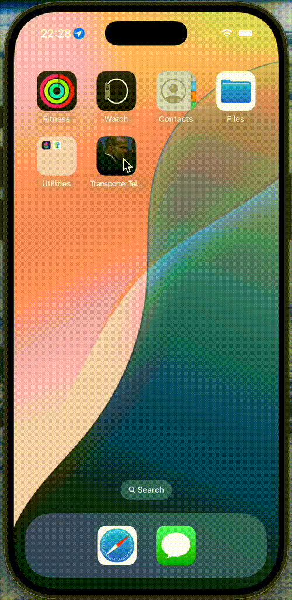

# Transporter Telemetry

The Transporter Telemetry App is a SwiftUI-based iOS application that collects and analyzes driving data to provide users with comprehensive insights into their driving patterns.

*Integrate with The Transpoter: Upload data generated by this app to [The Transpoter](https://github.com/denizardaslan/the-transporter) for enhanced insights.*

  

## Overview

The app is designed to:
- **Accurately capture driving metrics** with <1% error margin.
- **Engage users** with at least 3 recording sessions per week.
- **Ensure data reliability** with zero data loss during background operation.
- Provide **real-time performance updates** (<100ms latency).
- Optimize **battery usage** (<5% per hour of recording).

## Features

### Recording System
- Initial location permissions and background recording support.
- Tracks key metrics:
  - Speed (km/h, mph)
  - GPS location (latitude/longitude)
  - Distance traveled
  - Timestamps and session duration
  - Vehicle and driver information
  - Start and end location
- Generates unique session IDs and persists data as JSON files.

### Data Management
- Automatically creates JSON files per session.
- Lists and shares session files using the iOS share sheet.
- Supports swipe-to-delete functionality.
- Optimizes file size for long recordings.

### Real-time Display
- Live speed display with color indicators:
  - **Green:** Accelerating
  - **Red:** Decelerating
- Ongoing calculation of distance and elapsed time.
- 60-second speed graph updates.
- Seamless UI transitions to the recording view.

### Analytics Dashboard
- Session statistics include:
  - Total trip counter
  - Maximum speed tracker
  - Cumulative distance and driving time
- Visual data representations for insights.

### Settings Management
- Personalize driver profile and vehicle details.
- Choose tyre type:
  - Summer ☀️
  - Winter ❄️
  - All Season 🌧️
- Set unit preferences (km/h vs mph) and data retention policies.

## System Architecture

The app is built on these key components:

- **Core Location Manager:** Captures raw GPS data.
- **Data Processing Engine:** Calculates derived metrics.
- **Storage Manager:** Persists session data as JSON.
- **UI Layer:** Built with SwiftUI and Combine for a reactive user experience.
- **Background Task Manager:** Ensures continuous recording even when the app is in the background.

## Technical Stack
- **SwiftUI** – User Interface
- **Core Location** – GPS tracking
- **Combine** – Reactive updates
- **FileManager** – JSON storage
- **BackgroundTasks Framework** – Background processing

## Build & Run

This project is developed for iOS using Xcode. To build and run the app:
1. Open the [TransporterTelemetry.xcodeproj](TransporterTelemetry.xcodeproj) file in Xcode.
2. Select the desired scheme (TransporterTelemetry).
3. Build and run on your target iPhone or simulator.
4. Ensure location permissions are granted for the app to record sessions.

## Future Roadmap
- Enhance data encryption and privacy controls.
- Expand analytics with more detailed metrics and visualization.
- Optimize battery performance under various driving conditions.
- Improve background recording resilience and error handling.

## License

This project is licensed under the MIT License - see the LICENSE file for details.